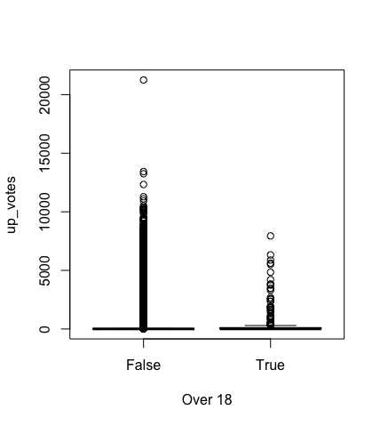
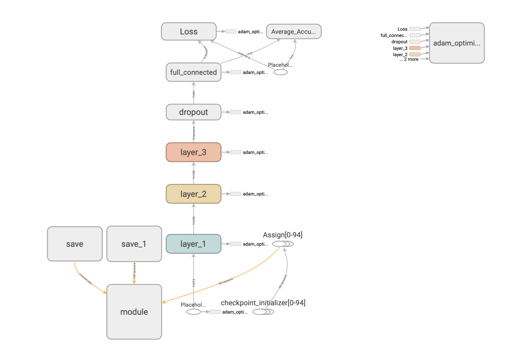

# Eluvio DS NLP problem

## The problem

The csv file contains 8 columns: created date, created time, up vote, down vote, title, author, over 18 and category.

After simple checking, it can be found that all the news belong to one category (world news) and the down votes are all zero. Thus, it will be interesting to explore the relationship with the up vote and other covariates.
For the up votes and the over 18, I give the following scatter plot. It can be seen that there is not strong relationship between these two variables.
  
Additionally, 85838 authors are included. Because of the large amount of the authors, here I only provided the first five authors with the highest average up votes.  

| author           | Ave.up votes  |
| -------------    |------------- |
| navysealassulter |  12333 |
| seapiglet        | 11288     |
| DawgsOnTopUGA    |  10515      |
| Flamo_the_Idiot_Boy | 10289      |
| haunted_cheesecake | 9408      |

However, I think there might be a strong relationship between the title and the up votes: 1) The title is related with the news content and the attractive content will obtain more up votes; 2) Interesting title will attract more readersm, which in turn will get more up votes. In order to study this relationship, we will use classify the news into two groups, one is attractive news and another is non-attractive news. This classification is based on a threshold determined by the data pattern. Also, the title will be converted to a numerical vector with the Universal Sentence Encoder.

## Steo 0: Data Processing

First, I use the 80% quantile of the up votes as the threshold to group the sample as the attractive news and non-attractive news. 

```python
# class the data into two groups: with threshold as the 80% of the up_votes
# if up_votes number > threshold is an attractive news; o.w. it is not an attractive news
threshold = np.quantile( df['up_votes'], 0.8) # corresponding value is 24
```

Because of the limited computation resource, I set about 5000 data as testing data and the rest as the training data. (This is because I need to evaluation the testing accuracy at each iteration. The large size of testing data will increase the evaluation time.)

## Step 1: the Universal Sentence Encoding

The method is the universal sentence encoder: https://arxiv.org/abs/1803.11175 

The main idea is to learning a vector for each sentence such that the sentences with similar semantics are corresponding to the vectors with the high correlation.

With the universal sentence encoder, the title can be converted to a vector as the covariate **x** for the model.

```python
import tensorflow as tf
import tensorflow_hub as hub

# The method is the universal sentence encoder: https://arxiv.org/abs/1803.11175
module_url = "https://tfhub.dev/google/universal-sentence-encoder-large/3"
# Import the Universal Sentence Encoder's TF Hub module
embed = hub.Module(module_url)

# the universal sentence encoder function
def USencoder(l):
    with tf.Session() as session:
        session.run([tf.global_variables_initializer(), tf.tables_initializer()])
        message_embeddings = session.run(embed(l))
        return message_embeddings
```

## Step 2: Deep Neural Network Classifier

Here I use the four layer Deep Neural Network Classifier (see the figure). In each layer, the Relu function is used as the activation function. The paramter settings for each layer are in the tabel.

| layer          | W  | b  |
| ----|----|---|
| Layer 1 |  512*256 | 256|
| Layer 2 | 256*128 | 128|
| Layer 3 |  128*64 | 64 |
| Dropout Layer | NA | NA |
| Layer 4 | 64*2 | 2|



Because the data is unbalanced: attractive/nonattractive $\approx$ 2/8. So I oversample the attracive news for the training: in each batch, the sample weights for attractive/nonattractive news are 0.8/0.2, repectively.

## Current result

## Some Idea

- So far, the classification results is not good enough. I think this is mainly because the universal sentence encoder can not efficiently extract the information from the titles. A good way to improve this is to use some NLP models to learning the sentence vectors for these titles.

- Another reason for the low accuary is because our algorithm doesn't converge. The result would be better with more iterations.

- The data is unbalanced. In my attempt, I use the oversample method to balance the data in the batch. I think it would be better to re-design the loss function.

- Due to the limited computation resource, I didn't use the overparameterized dnn model. But I think it will reduce the generalization error by increasing the parameter number.

- I think it will useful to add the time as covaraite to learning the deep learning model. But the structure needs to be modified.
